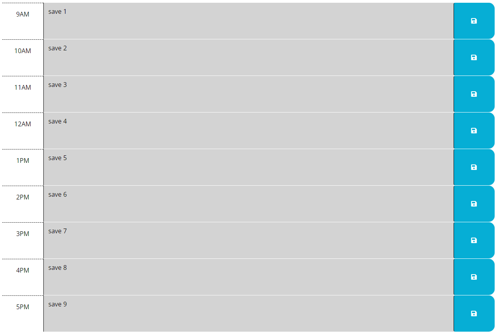

# Buonos Trivia

## Description
- The work day scheduler will keep track of your work day by the hour.
- You can enter your schedule criteria and the app will keep track of the time for you.
- The app will show you if your task is in the present time, future time, or past time to help manage your daily agenda.
- Use the clear all button to create a new daily task list. 

## Simple Installation

Simpily follow this  link to view view the Password Generator appplication. https://jeremiahmiranda79.github.io/work-day-scheduler/

## Usage

The header will display the date and time with updates per second in real time..

We can save our schedule to local storage for later usage. 

Fill in data!!!...

We can reste our local storage for a clean slate to add a new schedule.

## License

MiT

## Development

This project was created using Visual Code, HTML, CSS, GitHub, and JavaScript.

## How to Contribute

Currently this project is closed for contribution.

# Thank you
I appreciate your interest in my projects!